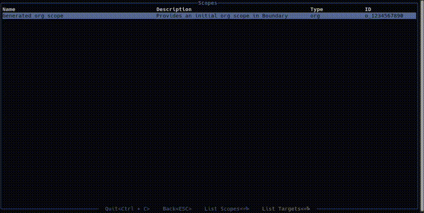

# bountui(/ˈbaʊn.ti/) - A Terminal UI for HashiCorp Boundary

**bountui** is a terminal-based user interface for interacting
with [HashiCorp Boundary](https://www.hashicorp.com/products/boundary). It provides an intuitive way to navigate scopes,
targets, and sessions, making Boundary management more accessible directly from your terminal.


---

## 🚀 Prerequisites

- **HashiCorp Boundary CLI**: Ensure `boundary` is installed and available in your system's `PATH`. You can find
  installation instructions in the [Boundary CLI documentation](https://developer.hashicorp.com/boundary/docs/cli).

---

## 📦 Installation

### ⬇️ GitHub Releases (Linux & MacOS)

The install script downloads the latest release binary from
[GitHub releases](https://github.com/Cedware/bountui/releases) and installs it to `~/.local/bin`:

```bash
curl -fsSL https://raw.githubusercontent.com/Cedware/bountui/main/scripts/install.sh | sh
```

To install to a different directory, set `BOUNTUI_INSTALL_DIR`:

```bash
curl -fsSL https://raw.githubusercontent.com/Cedware/bountui/main/scripts/install.sh | BOUNTUI_INSTALL_DIR=/usr/local/bin sh
```

Release builds check for a newer release automatically on startup and offer
to install it in a dialog. (The automatic check is skipped for binaries built
locally from source, which report the static `Cargo.toml` version.)

### 🪟 Windows

Run the install script in PowerShell. It downloads the latest release binary from
[GitHub releases](https://github.com/Cedware/bountui/releases), installs it to `~/.local/bin`
and adds that directory to your user `PATH`:

```powershell
irm https://raw.githubusercontent.com/Cedware/bountui/main/scripts/install.ps1 | iex
```

To install to a different directory, set `BOUNTUI_INSTALL_DIR` first:

```powershell
$env:BOUNTUI_INSTALL_DIR = "C:\tools\bin"
irm https://raw.githubusercontent.com/Cedware/bountui/main/scripts/install.ps1 | iex
```

### 🐧 Linux

#### Arch
bountui is available in the [AUR](https://aur.archlinux.org/packages/bountui/), so you can install it using your preferred AUR helper.
In this example, we will use `yay`, but you can use any AUR helper of your choice:
```bash
yay -S bountui
```

Updates are delivered through pacman — the built-in self-updater is disabled for this package.

### 🍎 MacOS

bountui is not yet available in the official Homebrew catalogue, but you can install it from the [cedware tap](https://github.com/Cedware/homebrew-tap):

```bash
brew tap cedware/tap
brew install bountui
```

This formula will automatically install the boundary CLI too, if you don't have it installed already.
Updates are delivered through Homebrew — the built-in self-updater is disabled for this install method.
If you want to see bountui in the official Homebrew catalogue, support this project by giving it a star!

### 🦀 From Source

If you prefer, you can build bountui from source. Ensure you have the Rust toolchain installed
([rustup](https://rustup.rs/)) and then run:

```bash
git clone https://github.com/Cedware/bountui.git
cd bountui
cargo build --release
```

After building, you can run bountui directly from the `target/release` directory:

```bash
./target/release/bountui
```

---

## 🔒 Authentication

Currently, bountui has been tested with **OIDC authentication**. Other methods may work but are not guaranteed. Methods
that require interaction with the terminal (e.g., password prompts) will **not** work.

### Authentication Compatibility Table

| Authentication Method | Compatibility   |
|-----------------------|-----------------|
| OIDC                  | ✅ Supported     |
| Password              | ❌ Not Supported |
| Auth Tokens           | ❌ Not Supported |
| LDAP                  | ❌ Not Supported |

---

## ⚙️ Compatibility

bountui has been tested with **Boundary 0.17.x**. Other versions may work but are not officially supported.

| Boundary Version | Compatibility |
|------------------|---------------|
| < 0.17.x         | ⚠️ Untested   |
| 0.17.x           | ✅ Supported   |
| 0.18.x           | ✅ Supported   |
| 0.19.x           | ✅ Supported   |
| \> 0.19.x        | ⚠️ Untested   |

---

## 🛠️ Usage

bountui provides several keyboard shortcuts for interacting with Boundary resources:

| Shortcut       | Function                                     |
|----------------|----------------------------------------------|
| `/`            | Search within table views                    |
| `⏎`            | Show child elements (conext sensitive)       |
| `c`            | Connect to the selected target               |
| `Shift+c`      | Show active sessions for the selected target |
| `v`            | Show the credentials of the selected target's connection (targets view, only when it has exactly one) or of the selected session (sessions view) |
| `Ctrl+d`       | Stop the selected session                    |
| `Ctrl+c`       | Quit bountui                                 |
| `Esc`          | Go back to the previous view                 |
| `:my-sessions` | Shows all sessions created by you            |
| `:scope-tree`  | Shows the default view                       |            

## Demo


